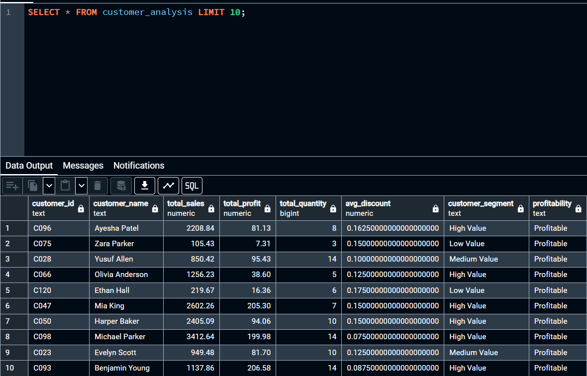
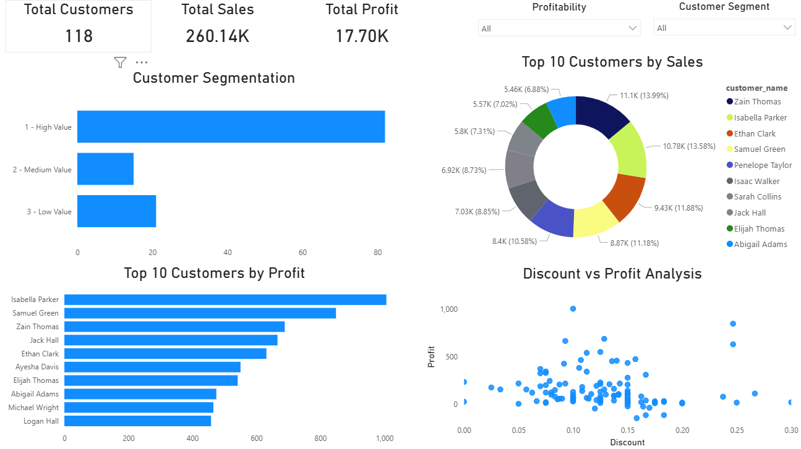

# Customer Segmentation & Sales Performance Analysis (SQL + Power BI)

## Overview
This project analyzes customer purchasing behavior to identify high-value customers, evaluate profitability, and understand the impact of discounts on business performance.

The goal is to move beyond raw data and provide actionable insights that support better pricing, targeting, and customer strategy decisions.

---

## Tools Used
- PostgreSQL
- SQL (CTEs, CASE statements, aggregations)
- Power BI (data modeling, DAX, visualization)

---

## Data Preparation

A SQL view (`customer_analysis`) was created to transform transactional data into customer-level insights.

Key transformations include:
- Aggregating total sales, profit, quantity, and average discount per customer
- Segmenting customers into:
  - High Value
  - Medium Value
  - Low Value
- Classifying customers as:
  - Profitable
  - Unprofitable

This structured dataset enables efficient analysis and dashboard reporting.

---

## Dashboard Features

The Power BI dashboard provides a comprehensive view of customer performance:

- **KPI Metrics**
  - Total Customers
  - Total Sales
  - Total Profit

- **Customer Segmentation**
  - Distribution of customers by value tier

- **Top Customers Analysis**
  - Top 10 customers by sales
  - Top 10 customers by profit

- **Profitability Insights**
  - Breakdown of profitable vs unprofitable customers

- **Discount vs Profit Analysis**
  - Visual exploration of how discounting impacts profitability

---

## Key Insights

- A small group of high-value customers contributes a disproportionate share of revenue
- Discounting does not consistently improve profitability and may reduce margins
- Customer profitability varies significantly, highlighting opportunities for better targeting
- Some customers generate sales but contribute little or negative profit

---

## Project Structure

data/
sql/
powerbi/
screenshots/
README.md

--

SQL View

Dashboard

